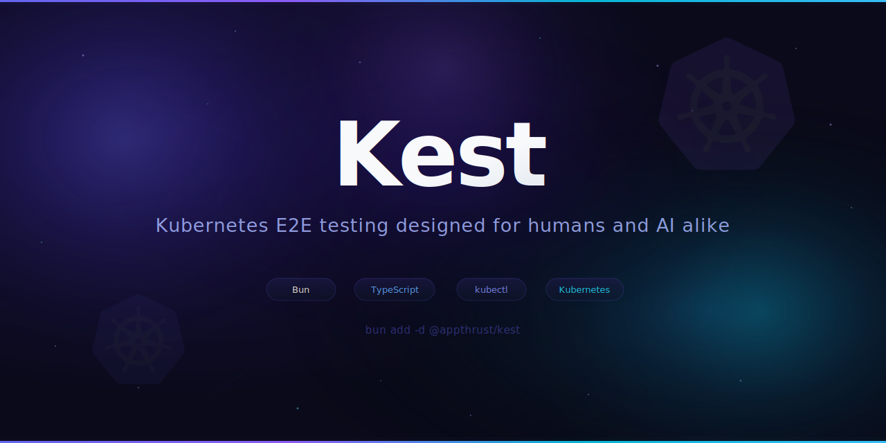

# Kest



> **Preview Release** -- Kest is currently in `0.x` preview. The API may change based on feedback. Breaking changes can occur in any `0.x` release. A stable `1.0.0` will be released once the API solidifies. Feel free to [open an issue](https://github.com/appthrust/kest/issues/new) if you have any feedback.

**Kubernetes E2E testing designed for humans and AI alike**

Kest makes it easy to write reliable end-to-end tests for Kubernetes controllers, operators, and admission webhooks. You write test scenarios in TypeScript with full type safety, autocompletion, and the familiar `expect()` API. When a test fails, Kest generates structured Markdown reports that are easy for humans to scan and for AI assistants to parse -- making troubleshooting straightforward regardless of who (or what) is debugging.

```ts
import { expect } from "bun:test";
import { test } from "@appthrust/kest";

test("Deployment creates expected ReplicaSet", async (s) => {
  s.given("a namespace exists");
  const ns = await s.newNamespace();

  s.when("I apply a Deployment");
  await ns.apply({
    apiVersion: "apps/v1",
    kind: "Deployment",
    metadata: { name: "my-app" },
    spec: {
      replicas: 2,
      selector: { matchLabels: { app: "my-app" } },
      template: {
        metadata: { labels: { app: "my-app" } },
        spec: { containers: [{ name: "app", image: "nginx" }] },
      },
    },
  });

  s.then("the Deployment should be available");
  await ns.assert({
    apiVersion: "apps/v1",
    kind: "Deployment",
    name: "my-app",
    test() {
      expect(this.status?.availableReplicas).toBe(2);
    },
  });
  // Cleanup is automatic: resources are deleted in reverse order,
  // then the namespace is removed.
});
```

## Why TypeScript?

YAML and Go are the norm in the Kubernetes ecosystem, so why TypeScript?

**Why not YAML?** E2E tests are inherently procedural -- apply resources, wait for reconciliation, assert state, clean up. YAML is a data format, not a programming language, and becomes clunky when you try to express these sequential workflows directly.

**Why not Go?** Go has an excellent Kubernetes client ecosystem, but TypeScript object literals are far more concise than Go structs for expressing Kubernetes manifests inline. Tests read closer to the YAML you already know, without the boilerplate of typed struct initialization and pointer helpers.

**What TypeScript brings:**

- **Editor support** -- autocompletion, inline type checking, go-to-definition
- **Readability** -- object literals map naturally to Kubernetes manifests
- **Flexibility** -- loops, conditionals, helper functions, and shared fixtures are just code
- **Ecosystem** -- use any npm package for setup, assertions, or data generation

## Features

### Ephemeral Namespaces

Each test gets an isolated, auto-generated namespace (e.g. `kest-a1b2c`). Resources are confined to this namespace, eliminating interference between tests and enabling safe parallel execution. The namespace is deleted when the test ends.

```ts
const ns = await s.newNamespace();
// All resources applied through `ns` are scoped to this namespace.
```

You can also specify a custom prefix for the generated namespace name using `generateName`:

```ts
const ns = await s.newNamespace({ generateName: "foo-" });
// Namespace name will be like "foo-d7kpn"
```

The returned object has a `name` property that holds the generated namespace name:

```ts
const ns = await s.newNamespace({ generateName: "foo-" });
console.log(ns.name); //=> "foo-d7kpn"
```

### Automatic Cleanup (Reverse-Order, Blocking)

Resources are deleted in the reverse order they were created (LIFO). Kest waits until each resource is fully removed before proceeding, preventing flaky failures caused by lingering resources or `Terminating` namespaces.

```
Created:   Namespace → ConfigMap → Deployment → Service
Cleaned:   Service → Deployment → ConfigMap → Namespace
```

### Retry-Based Assertions

Kubernetes is eventually consistent. Kest retries assertions automatically until they pass or a timeout expires, so you don't need fragile `sleep()` calls.

```ts
await ns.assert({
  apiVersion: "v1",
  kind: "ConfigMap",
  name: "my-config",
  test() {
    // Retried until this passes (default: 5s timeout, 200ms interval)
    expect(this.data?.mode).toBe("production");
  },
});
```

Custom timeouts are supported per action:

```ts
await ns.assert({
  apiVersion: "apps/v1",
  kind: "Deployment",
  name: "my-app",
  test() {
    expect(this.status?.availableReplicas).toBe(3);
  },
});
```

### Create Resources

Use `kubectl create` instead of `kubectl apply` when you need to ensure a resource is freshly created (e.g. the resource must not already exist, or you want to use `generateName`):

```ts
await ns.create({
  apiVersion: "v1",
  kind: "ConfigMap",
  metadata: { name: "my-config" },
  data: { mode: "demo" },
});
```

Like `apply`, `create` registers a cleanup handler that deletes the resource when the test ends. The key difference is that `kubectl create` fails if the resource already exists, whereas `kubectl apply` performs an upsert.

### Multiple Manifest Formats

Apply resources using whichever format is most convenient:

```ts
// Inline YAML string
await ns.apply(`
  apiVersion: v1
  kind: ConfigMap
  metadata:
    name: my-config
  data:
    mode: demo
`);

// TypeScript object literal (with type checking)
await ns.apply<ConfigMap>({
  apiVersion: "v1",
  kind: "ConfigMap",
  metadata: { name: "my-config" },
  data: { mode: "demo" },
});

// Imported YAML file
await ns.apply(import("./manifests/config-map.yaml"));
```

### Multi-Cluster Support

Test scenarios that span multiple clusters:

```ts
test("resources sync across clusters", async (s) => {
  const primary = await s.useCluster({ context: "kind-primary" });
  const secondary = await s.useCluster({
    context: "kind-secondary",
    kubeconfig: ".kubeconfig.yaml",
  });

  const ns1 = await primary.newNamespace();
  const ns2 = await secondary.newNamespace();

  await ns1.apply(/* ... */);
  await ns2.assert(/* ... */);
});
```

### Status Subresource Support

Simulate controller behavior by applying status subresources via server-side apply:

```ts
await ns.applyStatus({
  apiVersion: "example.com/v1",
  kind: "MyResource",
  metadata: { name: "my-resource" },
  status: {
    conditions: [
      {
        type: "Ready",
        status: "True",
        lastTransitionTime: "2026-01-01T00:00:00Z",
        reason: "Reconciled",
        message: "Resource is ready.",
      },
    ],
  },
});
```

### List Assertions

Assert against a collection of resources:

```ts
await ns.assertList<ConfigMap>({
  apiVersion: "v1",
  kind: "ConfigMap",
  test() {
    expect(this.some((c) => c.metadata.name === "my-config")).toBe(true);
    expect(this.some((c) => c.metadata.name === "deleted-config")).toBe(false);
  },
});
```

### Single-Resource List Assertions

Assert that exactly one resource of a kind exists (or matches a predicate) and test it:

```ts
// Assert exactly one ConfigMap exists and check its data
await ns.assertOne<ConfigMap>({
  apiVersion: "v1",
  kind: "ConfigMap",
  test() {
    expect(this.data?.mode).toBe("demo");
  },
});
```

Use the optional `where` predicate to narrow candidates when multiple resources exist:

```ts
// Find the one ConfigMap whose name starts with "generated-"
await ns.assertOne<ConfigMap>({
  apiVersion: "v1",
  kind: "ConfigMap",
  where: (cm) => cm.metadata.name.startsWith("generated-"),
  test() {
    expect(this.data?.mode).toBe("auto");
  },
});
```

`assertOne` throws if zero or more than one resource matches, and retries until exactly one is found or the timeout expires.

### Absence Assertions

Assert that a resource does not exist (e.g. after deletion or to verify a controller hasn't created something):

```ts
await ns.assertAbsence({
  apiVersion: "v1",
  kind: "ConfigMap",
  name: "deleted-config",
});
```

### Error Assertions

Assert that applying or creating a resource produces an error (e.g. an admission webhook rejects the request, or a validation rule fails). The `test` callback inspects the error -- `this` is bound to the `Error`:

```ts
await ns.assertApplyError({
  apply: {
    apiVersion: "example.com/v1",
    kind: "MyResource",
    metadata: { name: "my-resource" },
    spec: { immutableField: "changed" },
  },
  test() {
    expect(this.message).toContain("field is immutable");
  },
});
```

The `test` callback participates in retry -- if it throws, the action is retried until the callback passes or the timeout expires. This is useful when a webhook is being set up asynchronously:

```ts
await ns.assertApplyError({
  apply: {
    apiVersion: "example.com/v1",
    kind: "MyResource",
    metadata: { name: "my-resource" },
    spec: { immutableField: "changed" },
  },
  test(error) {
    expect(error.message).toContain("field is immutable");
  },
});
```

`assertCreateError` works identically for `kubectl create`:

```ts
await ns.assertCreateError({
  create: {
    apiVersion: "v1",
    kind: "ConfigMap",
    metadata: { name: "already-exists" },
  },
  test(error) {
    expect(error.message).toContain("already exists");
  },
});
```

If the apply/create unexpectedly succeeds (e.g. the webhook is not yet active), the resource is immediately reverted and the action retries until the expected error occurs.

### Label Resources

Add, update, or remove labels on Kubernetes resources using `kubectl label`:

```ts
await ns.label({
  apiVersion: "v1",
  kind: "ConfigMap",
  name: "my-config",
  labels: {
    env: "production", // add a label
    deprecated: null, // remove a label
  },
});
```

To overwrite an existing label, set `overwrite: true`:

```ts
await ns.label({
  apiVersion: "apps/v1",
  kind: "Deployment",
  name: "my-app",
  labels: {
    version: "v2",
  },
  overwrite: true,
});
```

### Shell Command Execution

Run arbitrary shell commands with optional revert handlers for cleanup:

```ts
const name = await s.exec({
  do: async ({ $ }) => {
    const name = "my-secret";
    await $`kubectl create secret generic ${name} --from-literal=password=s3cr3t`.quiet();
    return name;
  },
  revert: async ({ $ }) => {
    await $`kubectl delete secret my-secret`.quiet();
  },
});
```

### BDD-Style Reporting

Structure tests with Given/When/Then annotations for readable output:

```ts
test("ConfigMap lifecycle", async (s) => {
  s.given("a namespace exists");
  const ns = await s.newNamespace();

  s.when("I apply a ConfigMap");
  await ns.apply(/* ... */);

  s.then("the ConfigMap should have the expected data");
  await ns.assert(/* ... */);
});
```

### Markdown Test Reports

When a test fails (or when `KEST_SHOW_REPORT=1` is set), Kest generates a detailed Markdown report showing every action, the exact `kubectl` commands executed (including stdin manifests), stdout/stderr output, and cleanup results. This provides full transparency into what happened during the test, making troubleshooting straightforward -- for both humans and AI assistants.

````markdown
# ConfigMap lifecycle

## Scenario Overview

| #   | Action                         | Status |
| --- | ------------------------------ | ------ |
| 1   | Apply Namespace `kest-9hdhj`   | ✅     |
| 2   | Apply `ConfigMap` "my-config"  | ✅     |
| 3   | Assert `ConfigMap` "my-config" | ✅     |

## Scenario Details

### Given: a namespace exists

**✅ Apply Namespace `kest-9hdhj`**

```shell
kubectl apply -f - <<EOF
apiVersion: v1
kind: Namespace
metadata:
  name: kest-9hdhj
EOF
```

...

### Cleanup

| #   | Action                         | Status |
| --- | ------------------------------ | ------ |
| 1   | Delete `ConfigMap` "my-config" | ✅     |
| 2   | Delete Namespace `kest-9hdhj`  | ✅     |

```shellsession
$ kubectl delete ConfigMap/my-config -n kest-9hdhj
configmap "my-config" deleted

$ kubectl delete namespace/kest-9hdhj
namespace "kest-9hdhj" deleted
```
````

## Getting Started

### Prerequisites

- [Bun](https://bun.sh/) v1.3.8 or later
- `kubectl` configured with access to a Kubernetes cluster
- A running Kubernetes cluster (e.g. [kind](https://kind.sigs.k8s.io/), [minikube](https://minikube.sigs.k8s.io/), or a remote cluster)

### Installation

```sh
bun add -d @appthrust/kest
```

### TypeScript Configuration

If your project doesn't have a `tsconfig.json` yet, install the Bun TypeScript preset and create one:

```sh
bun add -D @types/bun @tsconfig/bun
```

```json
// tsconfig.json
{
  "extends": "@tsconfig/bun"
}
```

This enables proper type checking, autocompletion, and compatibility with Bun's APIs.

### Write Your First Test

Create a test file, e.g. `my-operator.test.ts`:

```ts
import { expect } from "bun:test";
import { test } from "@appthrust/kest";

test("ConfigMap is created with correct data", async (s) => {
  s.given("a new namespace exists");
  const ns = await s.newNamespace();

  s.when("I apply a ConfigMap");
  await ns.apply({
    apiVersion: "v1",
    kind: "ConfigMap",
    metadata: { name: "app-config" },
    data: { environment: "test" },
  });

  s.then("the ConfigMap should contain the expected data");
  await ns.assert({
    apiVersion: "v1",
    kind: "ConfigMap",
    name: "app-config",
    test() {
      expect(this.data?.environment).toBe("test");
    },
  });
});
```

### Run Tests

```sh
bun test
```

To always show the Markdown test report (not just on failure):

```sh
KEST_SHOW_REPORT=1 bun test
```

## API Reference

### `test(label, callback, options?)`

Entry point for defining a test scenario. The callback receives a `Scenario` object.

| Option    | Type     | Default | Description                          |
| --------- | -------- | ------- | ------------------------------------ |
| `timeout` | `string` | `"60s"` | Maximum duration for the entire test |

### Scenario

The top-level API surface available in every test callback.

| Method                                                                  | Description                                                 |
| ----------------------------------------------------------------------- | ----------------------------------------------------------- |
| `apply(manifest, options?)`                                             | Apply a Kubernetes manifest and register cleanup            |
| `create(manifest, options?)`                                            | Create a Kubernetes resource and register cleanup           |
| `assertApplyError(input, options?)`                                     | Assert that `kubectl apply` produces an error               |
| `assertCreateError(input, options?)`                                    | Assert that `kubectl create` produces an error              |
| `applyStatus(manifest, options?)`                                       | Apply a status subresource (server-side apply)              |
| `delete(resource, options?)`                                            | Delete a resource by API version, kind, and name            |
| `label(input, options?)`                                                | Add, update, or remove labels on a resource                 |
| `get(resource, options?)`                                               | Fetch a resource by API version, kind, and name             |
| `assert(resource, options?)`                                            | Fetch a resource and run assertions with retries            |
| `assertAbsence(resource, options?)`                                     | Assert that a resource does not exist                       |
| `assertList(resource, options?)`                                        | Fetch a list of resources and run assertions                |
| `assertOne(resource, options?)`                                         | Assert exactly one resource matches, then run assertions    |
| `newNamespace(name?, options?)`                                         | Create an ephemeral namespace (supports `{ generateName }`) |
| `generateName(prefix)`                                                  | Generate a random-suffix name (statistical uniqueness)      |
| `exec(input, options?)`                                                 | Execute shell commands with optional revert                 |
| `useCluster(ref)`                                                       | Create a cluster-bound API surface                          |
| `given(desc)` / `when(desc)` / `then(desc)` / `and(desc)` / `but(desc)` | BDD annotations for reporting                               |

### Namespace / Cluster

Returned by `newNamespace()` and `useCluster()` respectively. They expose the same core methods (`apply`, `create`, `assertApplyError`, `assertCreateError`, `applyStatus`, `delete`, `label`, `get`, `assert`, `assertAbsence`, `assertList`, `assertOne`) scoped to their namespace or cluster context. `Cluster` additionally supports `newNamespace`.

`Namespace` also exposes a `name` property:

| Property | Type     | Description                                        |
| -------- | -------- | -------------------------------------------------- |
| `name`   | `string` | The generated namespace name (e.g. `"kest-abc12"`) |

### Action Options

All actions accept an optional options object for retry configuration.

| Option     | Type     | Default   | Description                  |
| ---------- | -------- | --------- | ---------------------------- |
| `timeout`  | `string` | `"5s"`    | Maximum retry duration       |
| `interval` | `string` | `"200ms"` | Delay between retry attempts |

Duration strings support units like `"200ms"`, `"5s"`, `"1m"`.

## Best Practices

### Test API contracts, not controllers

E2E tests should describe **how an API behaves from the user's perspective**, not how a specific controller implements that behavior internally. The subject of every test should be the API resource, not the controller behind it.

Why? Controllers are an implementation detail. They get renamed, split, merged, or rewritten -- but as long as the API contract is unchanged, users are unaffected. If your tests are written in terms of controllers, a harmless refactor can break your entire test suite.

```ts
// ✅ Good — the subject is the API resource
test("Tenant API creates namespaces for each tenant", async (s) => {
  s.given("a Tenant resource is applied");
  const ns = await s.newNamespace();
  await ns.apply({
    apiVersion: "example.com/v1",
    kind: "Tenant",
    metadata: { name: "acme" },
    spec: { namespaces: ["dev", "staging"] },
  });

  s.then("the Tenant reports Ready=True");
  await ns.assert({
    apiVersion: "example.com/v1",
    kind: "Tenant",
    name: "acme",
    test() {
      expect(this.status?.conditions).toContainEqual(
        expect.objectContaining({ type: "Ready", status: "True" }),
      );
    },
  });
});
```

```ts
// ❌ Bad — the subject is the controller (implementation detail)
test("tenant-controller creates namespaces", async (s) => {
  s.given("tenant-controller is running");
  // ...
  s.then("tenant-controller creates child namespaces");
  // ...
});
```

The same principle applies to BDD annotations -- keep `s.given()`, `s.when()`, and `s.then()` free of controller names:

| ❌ Controller-centric                             | ✅ API-centric                            |
| ------------------------------------------------- | ----------------------------------------- |
| `s.given("tenant-controller is running")`         | `s.given("a Tenant resource exists")`     |
| `s.when("tenant-controller reconciles")`          | `s.when("the Tenant spec is updated")`    |
| `s.then("tenant-controller creates a Namespace")` | `s.then("the expected Namespace exists")` |

### Choosing what to test in E2E

E2E tests are powerful for validating **user-observable behavior** but expensive for verifying internal details. Placing implementation details in E2E tests makes refactoring harder without giving users any extra confidence.

**Good candidates for E2E (API contract):**

- Status transitions -- e.g. a resource reaches `Ready=True` after creation
- Error feedback -- e.g. invalid input produces an explanatory condition like `Ready=False, reason=InvalidSpec`
- User-facing side effects -- e.g. resources that users are expected to observe or interact with

```ts
// ✅ Assert a user-observable status condition
await ns.assert({
  apiVersion: "example.com/v1",
  kind: "Database",
  name: "my-db",
  test() {
    expect(this.status?.conditions).toContainEqual(
      expect.objectContaining({ type: "Ready", status: "True" }),
    );
  },
});
```

**Better left to unit / integration tests (implementation details):**

- Internal label keys, annotation formats, or hash values
- Intermediate resources that users don't directly interact with
- Controller-internal reconciliation logic and branching

```ts
// ❌ Avoid — internal label format is an implementation detail
await ns.assert({
  apiVersion: "example.com/v1",
  kind: "Database",
  name: "my-db",
  test() {
    // This label may change without affecting users
    expect(this.metadata?.labels?.["internal.example.com/config-hash"]).toBe("a1b2c3");
  },
});
```

When you find yourself wanting to E2E-test an intermediate resource, ask: _"Is this part of the public API contract?"_ If yes, document it as such and test it. If no, push the assertion down to a cheaper test layer and keep E2E focused on what users actually see.

### Organizing test files

Structure test directories around **API resources**, not controllers. This makes the test suite resilient to internal refactoring and immediately tells readers _which API behavior_ is being verified.

```
# ✅ Good — organized by API resource
tests/e2e/
├── tenant-api/
│   ├── creation.test.ts
│   └── deletion.test.ts
├── database-api/
│   └── provisioning.test.ts

# ❌ Bad — organized by controller (implementation detail)
tests/e2e/
├── tenant-controller/
│   ├── creation.test.ts
│   └── deletion.test.ts
├── database-controller/
│   └── provisioning.test.ts
```

**Refactoring-friendliness checklist** -- the more "yes" answers, the better your E2E tests:

- [ ] Is the subject of every test an API resource (not a controller)?
- [ ] Can a reader understand the test from the manifest and assertions alone?
- [ ] Do `then` assertions only check user-observable state (`status`, contracted outputs)?
- [ ] Would splitting, merging, or renaming controllers leave all tests passing?

### One scenario per file

Put exactly one test scenario in one file -- from the start, not "when it gets big enough."

It may be tempting to group several short scenarios into one file while they are small. But E2E tests grow: assertions get richer, edge-case inputs appear, debug aids are added. Splitting later is far harder than starting separate, and deciding _when_ to split is an unnecessary judgment call. The simplest policy is the best one: one scenario, one file, always.

```
tests/e2e/tenant-api/
├── creates-namespaces-for-each-tenant.test.ts
├── rejects-duplicate-tenant-names.test.ts
├── updates-status-on-namespace-failure.test.ts
└── deletes-child-namespaces-on-removal.test.ts
```

**Why not "split when it gets big"?**

- Tests grow incrementally -- no single commit feels like "the moment to split," so it never happens.
- Splitting a file retroactively means rewriting imports, moving fixtures, and touching unrelated tests in the same PR.
- The threshold itself becomes a debate ("Is 250 lines too many? 400?"). A universal rule eliminates the discussion.

Starting with one file per scenario reserves room to grow. Each file has built-in headroom for richer assertions, additional setup steps, and debug annotations -- without ever crowding a neighbor.

**What you get:**

- **Self-contained reading** -- open one file, see the full Given/When/Then without scrolling past unrelated scenarios.
- **Surgical diffs** -- a change touches exactly one scenario, keeping PRs small and reviews focused.
- **Failure as an address** -- a failing file name tells you which API contract broke, before you read a single line of output.
- **Conflict-free collaboration** -- teammates edit different files, not different sections of the same file.

**Name files after the behavior they verify.** A reader should know what a test checks without opening the file:

| ✅ Good                                    | ❌ Bad                     |
| ------------------------------------------ | -------------------------- |
| `creates-namespaces-with-labels.test.ts`   | `tenant-test-1.test.ts`    |
| `rejects-reserved-selector-labels.test.ts` | `validation.test.ts`       |
| `rolls-out-when-image-changes.test.ts`     | `deployment-tests.test.ts` |

**Exceptions.** Tiny negative-case variations of the same API -- where each case is only a few lines and they are always read together (e.g. boundary-condition lists) -- may share a file. When you do this, leave a comment explaining why, because the exception easily becomes the norm.

**One-scenario-per-file checklist:**

- [ ] Does each test file contain exactly one scenario?
- [ ] Does the file name describe the behavior under test (not the controller)?
- [ ] If a file has multiple scenarios, is there a comment justifying the exception?

### Keep manifests visible in your tests

E2E tests double as living documentation. Every test should read as a self-contained specification: what was applied (Given), what changed (When), and what should be true (Then). When a helper function assembles the entire manifest behind the scenes, the test body may _look_ cleaner -- but it stops serving as documentation because the reader can no longer see the actual input.

```ts
// ❌ Bad — looks tidy, but the actual manifest is hidden inside makeDeployment().
//    A reader cannot tell what is being applied without jumping to the helper.
//    The diff between v1 and v2 is buried in a parameter change.
function makeDeployment(name: string, image: string) {
  return {
    apiVersion: "apps/v1",
    kind: "Deployment",
    metadata: { name, labels: { app: name } },
    spec: {
      replicas: 2,
      selector: { matchLabels: { app: name } },
      template: {
        metadata: { labels: { app: name } },
        spec: { containers: [{ name: "app", image }] },
      },
    },
  };
}

test("rollout updates the image", async (s) => {
  const ns = await s.newNamespace();
  await ns.apply(makeDeployment("my-app", "my-app:v1"));
  await ns.apply(makeDeployment("my-app", "my-app:v2"));
  // What exactly changed? You have to read makeDeployment to find out.
});
```

```ts
// ✅ Good — the full manifest is right here; the diff between steps is obvious.
test("rollout updates the image", async (s) => {
  const ns = await s.newNamespace();

  s.when("I apply a Deployment at v1");
  await ns.apply({
    apiVersion: "apps/v1",
    kind: "Deployment",
    metadata: { name: "my-app" },
    spec: {
      replicas: 2,
      selector: { matchLabels: { app: "my-app" } },
      template: {
        metadata: { labels: { app: "my-app" } },
        spec: { containers: [{ name: "app", image: "my-app:v1" }] },
      },
    },
  });

  s.when("I update to v2");
  await ns.apply({
    apiVersion: "apps/v1",
    kind: "Deployment",
    metadata: { name: "my-app" },
    spec: {
      replicas: 2,
      selector: { matchLabels: { app: "my-app" } },
      template: {
        metadata: { labels: { app: "my-app" } },
        spec: { containers: [{ name: "app", image: "my-app:v2" }] },
        //                                          ^^^^^^^^^ the diff
      },
    },
  });
});
```

The duplication is intentional -- in E2E tests, **readability beats DRY**. Duplicated manifests make each test self-explanatory and keep failure reports easy to match against the test source. Notice the `^^^ the diff` comment in the example above -- adding a short inline comment to highlight the key change is a simple technique that makes the intent even clearer.

When manifests become too large to inline comfortably, extract them into **static fixture files** instead of helper functions. Both YAML and TypeScript files work:

```ts
// ✅ Good — static fixture files keep the input visible at a glance
await ns.apply(import("./fixtures/deployment-v1.yaml"));
await ns.apply(import("./fixtures/deployment-v2.yaml"));

// TypeScript files work too — useful when converting from inline objects
await ns.apply(import("./fixtures/deployment-v1.ts"));
```

**Manifest-visibility checklist:**

- [ ] Can you understand the full input by reading just the test file?
- [ ] Is the diff between test steps visible as a spec-level change?
- [ ] Can you reconstruct the applied manifest from the failure report alone?

### Reuse manifests with mutation for update scenarios

The "keep manifests visible" principle works well when each `apply` is independent. But in **update scenarios** -- where a test applies the same resource twice with a small change -- duplicating the entire manifest obscures the intent. The reader has to mentally diff two large blocks to spot what actually changed:

```ts
// ❌ Bad — the two manifests are nearly identical.
//    The reader must scan every line to find the one difference.
test("scaling up increases available replicas", async (s) => {
  const ns = await s.newNamespace();

  s.when("I apply a Deployment with 1 replica");
  await ns.apply({
    apiVersion: "apps/v1",
    kind: "Deployment",
    metadata: { name: "my-app" },
    spec: {
      replicas: 1,
      selector: { matchLabels: { app: "my-app" } },
      template: {
        metadata: { labels: { app: "my-app" } },
        spec: { containers: [{ name: "app", image: "nginx" }] },
      },
    },
  });

  s.when("I scale to 3 replicas");
  await ns.apply({
    apiVersion: "apps/v1",
    kind: "Deployment",
    metadata: { name: "my-app" },
    spec: {
      replicas: 3, // <-- the only change, buried in a wall of duplication
      selector: { matchLabels: { app: "my-app" } },
      template: {
        metadata: { labels: { app: "my-app" } },
        spec: { containers: [{ name: "app", image: "nginx" }] },
      },
    },
  });

  s.then("the Deployment should have 3 available replicas");
  await ns.assert({
    apiVersion: "apps/v1",
    kind: "Deployment",
    name: "my-app",
    test() {
      expect(this.status?.availableReplicas).toBe(3);
    },
  });
});
```

Instead, define the manifest once, then use `structuredClone` to create a copy and mutate only the fields the scenario cares about. The mutation lines **are** the test scenario -- they tell the reader exactly what changed:

```ts
// ✅ Good — the base manifest is visible, and the mutation is the scenario.
test("scaling up increases available replicas", async (s) => {
  const ns = await s.newNamespace();

  s.when("I apply a Deployment with 1 replica");
  const deployment = {
    apiVersion: "apps/v1" as const,
    kind: "Deployment" as const,
    metadata: { name: "my-app" },
    spec: {
      replicas: 1,
      selector: { matchLabels: { app: "my-app" } },
      template: {
        metadata: { labels: { app: "my-app" } },
        spec: { containers: [{ name: "app", image: "nginx" }] },
      },
    },
  };
  await ns.apply(deployment);

  s.when("I scale to 3 replicas");
  const scaled = structuredClone(deployment);
  scaled.spec.replicas = 3;
  await ns.apply(scaled);

  s.then("the Deployment should have 3 available replicas");
  await ns.assert({
    apiVersion: "apps/v1",
    kind: "Deployment",
    name: "my-app",
    test() {
      expect(this.status?.availableReplicas).toBe(3);
    },
  });
});
```

`structuredClone` is a standard API (no dependencies) that creates a true deep copy, so mutations never affect the original. The base manifest stays fully visible in the test, and the mutation lines make the intent unmistakable.

**When to use which approach:**

| Scenario                                                  | Approach                                                 |
| --------------------------------------------------------- | -------------------------------------------------------- |
| Each `apply` is a different resource or independent input | Inline each manifest separately (keep manifests visible) |
| The same resource is applied twice with a small change    | `structuredClone` + targeted mutation                    |
| The manifest is too large to inline comfortably           | Static fixture files (`import("./fixtures/...")`)        |

**Mutation-readability checklist:**

- [ ] Is the base manifest defined once and fully visible in the test?
- [ ] Are only the fields relevant to the scenario mutated?
- [ ] Can a reader understand the update by reading just the mutation lines?

### Avoiding naming collisions between tests

When tests run in parallel, hard-coded resource names can collide. In most cases, `newNamespace()` is all you need -- each test gets its own namespace, so names like `"my-config"` or `"my-app"` are already isolated:

```ts
const ns = await s.newNamespace();

await ns.apply({
  apiVersion: "v1",
  kind: "ConfigMap",
  metadata: { name: "app-config" }, // safe — no other test shares this namespace
  data: { mode: "test" },
});
```

Because the namespace itself is unique, the resource names inside it don't need to be randomized. **You only need `s.generateName` when `newNamespace` alone is not enough.**

A common mistake is to reach for `s.generateName` on _every_ resource "just to be safe." This adds no real protection when the resources are already in an isolated namespace, and it makes tests harder to read and debug:

```ts
// ❌ Bad — generateName on namespaced resources inside an isolated namespace.
//    The random suffixes add noise without preventing any actual collisions.
const ns = await s.newNamespace();

const configName = s.generateName("cfg-");
const deployName = s.generateName("deploy-");

await ns.apply({
  apiVersion: "v1",
  kind: "ConfigMap",
  metadata: { name: configName }, // "cfg-x7k2m" — hard to find in logs
  data: { mode: "test" },
});
await ns.apply({
  apiVersion: "apps/v1",
  kind: "Deployment",
  metadata: { name: deployName }, // "deploy-p3n8r" — what was this test about?
  // ...
});
```

```ts
// ✅ Good — fixed, descriptive names inside an isolated namespace.
//    The namespace already guarantees no collisions. Fixed names are
//    easy to read, easy to grep in logs, and match the failure report.
const ns = await s.newNamespace();

await ns.apply({
  apiVersion: "v1",
  kind: "ConfigMap",
  metadata: { name: "app-config" },
  data: { mode: "test" },
});
await ns.apply({
  apiVersion: "apps/v1",
  kind: "Deployment",
  metadata: { name: "my-app" },
  // ...
});
```

**When to use `s.generateName`:**

| Situation                                              | Approach                                  |
| ------------------------------------------------------ | ----------------------------------------- |
| Namespaced resource inside `newNamespace()`            | Use a fixed name (default)                |
| Same-kind resources created multiple times in one test | `s.generateName` or numbered fixed names  |
| Cluster-scoped resource (e.g. `ClusterRole`, `CRD`)    | `s.generateName` (no namespace isolation) |
| Fixed name causes unintended upsert / side effects     | `s.generateName`                          |

Choose **necessary and sufficient** over "safe side" -- every random suffix is a readability trade-off.

**How the two helpers work:**

- `newNamespace(...)` creates a `Namespace` via `kubectl create` and retries on name collisions (regenerating a new name each attempt), so once it succeeds the namespace name is guaranteed unique in the cluster.
- `s.generateName(...)` is a pure string helper that provides **statistical uniqueness** only (collisions are extremely unlikely, but not impossible).

**Using `newNamespace` with `.name` (cross-namespace references):**

Every `Namespace` object returned by `newNamespace` has a `.name` property. When resources in one namespace need to reference another namespace by name -- for example in cross-namespace `spec.*Ref.namespace` fields -- use `.name`:

```ts
const nsA = await s.newNamespace({ generateName: "infra-" });
const nsB = await s.newNamespace({ generateName: "app-" });

s.when("I apply a resource in nsB that references nsA");
await nsB.apply({
  apiVersion: "example.com/v1",
  kind: "AppConfig",
  metadata: { name: "my-app" },
  spec: {
    secretStoreRef: {
      namespace: nsA.name, // e.g. "infra-k7rtn"
      name: "vault",
    },
  },
});
```

**Using `s.generateName` (for cluster-scoped resources):**

For cluster-scoped resources (where `newNamespace` is not applicable), use `s.generateName`:

```ts
s.given("a cluster-scoped resource name should not collide with other tests");
const roleName = s.generateName("kest-e2e-role-");

await s.create({
  apiVersion: "rbac.authorization.k8s.io/v1",
  kind: "ClusterRole",
  metadata: { name: roleName },
  rules: [
    {
      apiGroups: [""],
      resources: ["configmaps"],
      verbs: ["get", "list"],
    },
  ],
});
```

**Naming-collision checklist:**

- [ ] Are namespaced resources inside `newNamespace` using fixed names (not `generateName`)?
- [ ] Is `generateName` reserved for cluster-scoped resources or multi-instance cases?
- [ ] Can you identify every resource in the failure report without decoding random suffixes?

### Use `toMatchObject` for assertions without type parameters

When you omit the type parameter from assertion actions (`assert`, `assertList`,
`assertOne`, etc.), `this` is typed as the generic `K8sResource`. Custom fields
like `spec` become `unknown`, forcing type casts on every access:

```ts
// ❌ Without a type parameter, every field access needs a cast
await ns.assert({
  apiVersion: "example.com/v1",
  kind: "MyResource",
  name: "my-instance",
  test() {
    expect((this.spec as any).replicas).toBe(3);
    expect((this.spec as any).image).toBe("my-app:latest");
  },
});
```

Use `toMatchObject` instead — it accepts a plain object and checks that the
resource contains the expected subset, with no type narrowing required:

```ts
// ✅ toMatchObject — no casts, no type parameter needed
await ns.assert({
  apiVersion: "example.com/v1",
  kind: "MyResource",
  name: "my-instance",
  test() {
    expect(this).toMatchObject({
      spec: {
        replicas: 3,
        image: "my-app:latest",
      },
    });
  },
});
```

**When to use which:**

- **With a type parameter** (e.g. `assert<MyResource>`) — either style works; `this` is fully typed, so it's a matter of preference.
- **Without a type parameter** — always use `toMatchObject`. `this.spec` is `unknown`, and `toMatchObject` scales naturally as you add more assertions.

### Prefer whole-array assertions over for-loops in `assertList`

Avoid `for` loops inside `assertList` — when an assertion fails, the error doesn't identify which item caused it:

```ts
// ❌ Failure messages are opaque — which Secret failed?
test() {
  for (const s of this) {
    expect(s.metadata.labels).toMatchObject({ app: "my-app" });
  }
}

// ✅ Assert the whole array — full per-item diff on failure
test() {
  expect(this).toMatchUnordered([
    { metadata: { name: "secret-a", labels: { app: "my-app" } } },
    { metadata: { name: "secret-b", labels: { app: "my-app" } } },
  ]);
}
```

`toMatchUnordered` uses deep partial matching (like `toMatchObject`) but ignores order. Neither matcher checks array length — use `toHaveLength` when you need an exact count.

| Matcher | Order-sensitive | Matching |
|---|---|---|
| `toMatchObject([...])` | yes | deep partial |
| `toMatchUnordered([...])` | no | deep partial |

## Type Safety

Define TypeScript interfaces for your Kubernetes resources to get full type checking in manifests and assertions:

```ts
import type { K8sResource } from "@appthrust/kest";

interface MyCustomResource extends K8sResource {
  apiVersion: "example.com/v1";
  kind: "MyResource";
  metadata: { name: string };
  spec: {
    replicas: number;
    image: string;
  };
  status?: {
    conditions: Array<{
      type: string;
      status: "True" | "False" | "Unknown";
    }>;
  };
}

// Full autocompletion and type checking:
await ns.apply<MyCustomResource>({
  apiVersion: "example.com/v1",
  kind: "MyResource",
  metadata: { name: "my-instance" },
  spec: { replicas: 3, image: "my-app:latest" },
});

await ns.assert<MyCustomResource>({
  apiVersion: "example.com/v1",
  kind: "MyResource",
  name: "my-instance",
  test() {
    // `this` is typed as MyCustomResource
    expect(this.spec.replicas).toBe(3);
  },
});
```

## Tips

### Debugging failed tests

By default, Kest cleans up all resources after every test -- even when the test fails. This keeps the cluster tidy but destroys the state you need for debugging. To preserve resources on failure, set `KEST_PRESERVE_ON_FAILURE=1`:

```sh
KEST_PRESERVE_ON_FAILURE=1 bun test
```

When active, Kest skips cleanup for failed scenarios so you can inspect the cluster with `kubectl`. The test report will show a "Cleanup (skipped)" notice instead of the usual cleanup table. Remember to delete the leftover resources manually once you're done investigating.

## Environment Variables

| Variable                    | Description                                                             |
| --------------------------- | ----------------------------------------------------------------------- |
| `KEST_SHOW_REPORT`          | Set to `"1"` to show Markdown reports for all tests (not just failures) |
| `KEST_SHOW_EVENTS`          | Set to `"1"` to dump raw recorder events for debugging                  |
| `KEST_PRESERVE_ON_FAILURE`  | Set to `"1"` to skip cleanup when a test fails, preserving cluster state for debugging |

## License

[MIT](LICENSE)
